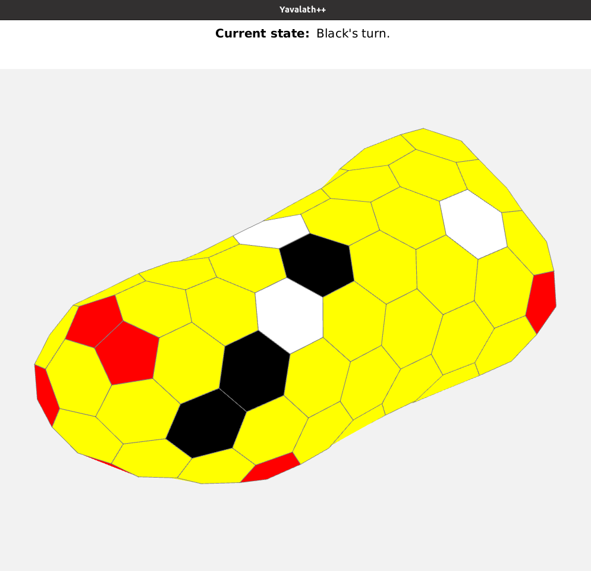

[◀️Back to the roadmap](../roadmap.md#2020)
# Yavalath
### Description
A board game AI written in Java for the course Algorithms and Datastructures. But instead of on a simple board, it was a 3D version. There are 2 versions of the AI. One that is very fast (uses heuristics) but doesn’t always play the most optimal move. And one that is slower but searches the entire game-tree to find the most optimal move (uses the alpha-beta pruning algorithm that is based on the minimax algorithm).\

