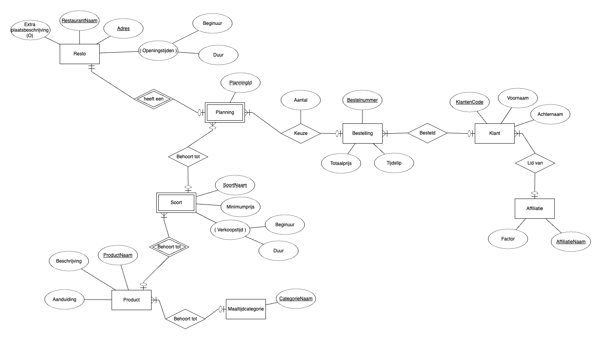

# UGent Restaurant Database

### First things first
In order to know what this database needs, we need to gather information about it.
So we first conduct a few types of investigations/analyses:
- domain analyses
- functionality analyses
- requirements analyses

### What to do with the information
We want to visualize the information in a more abstract way. For this we can use an EER-diagram (Enhanced Entity-Relationship-diagram). 

If we stumble upon certain important pieces of information that we can't place in the EER-diagram, we add a functional description.

_Note that the scheme below is made in my native language, Dutch._

### Transition from information to design
Once we have an EER-diagram, it is very easy to make a relational-database-scheme.

On the rare occasion that there is something that can't easily be implemented in a relational-database-scheme, you write it down so that you don't forget it!

### Implementing the Database
For the database we went with the open-source dbms PostgreSQL. 

Implement everything from the relational-database-scheme, and add some kind of constraints for the extra things you wrote down.
