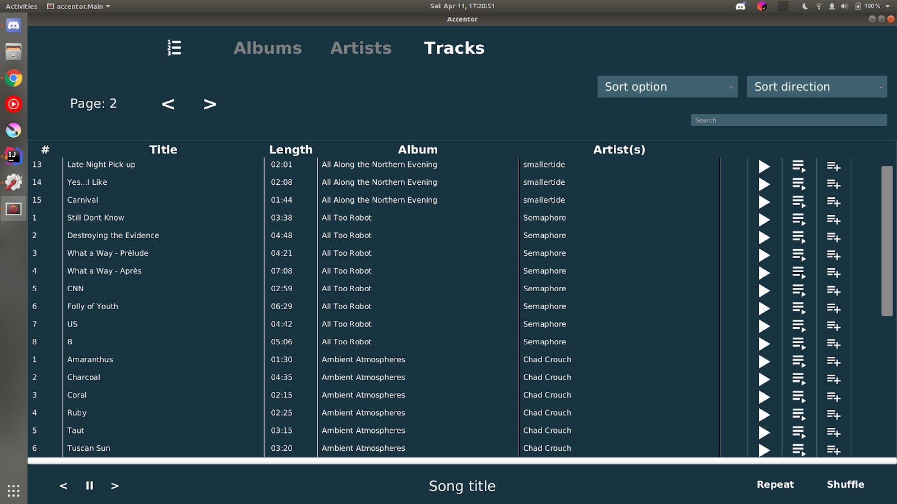
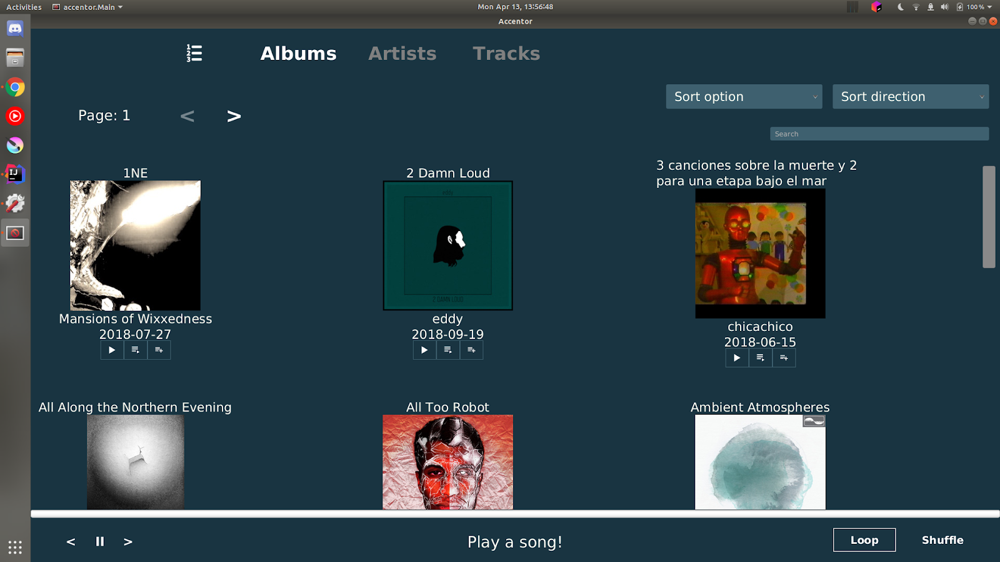

# Accentor

The goal of this project was to create a fully working desktop-application for an existing music library (playing songs, placing them in a queue, sorting tracks, searching tracks, …). The music library was accessible via a REST API.

This application was written in Java (with JavaFX).
It was implemented using an object-oriented style, combined with Model View Controller (a style of reactive programming).

