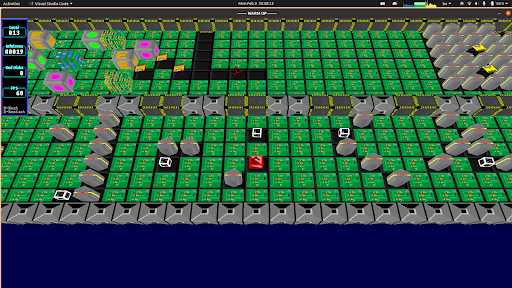

# Sysplex
A 3D version of the video game Supaplex. Optimized to run on a Raspberry Pi 3 and above. This version includes all original features of the original game from 1991 (which was in 2D). There is also a save/load system and a menu included

For this project we worked in groups of 2 on Github. The game itself is implemented as an entity-system framework and is written in C. The menu and save/load capabilities are written in C++.

