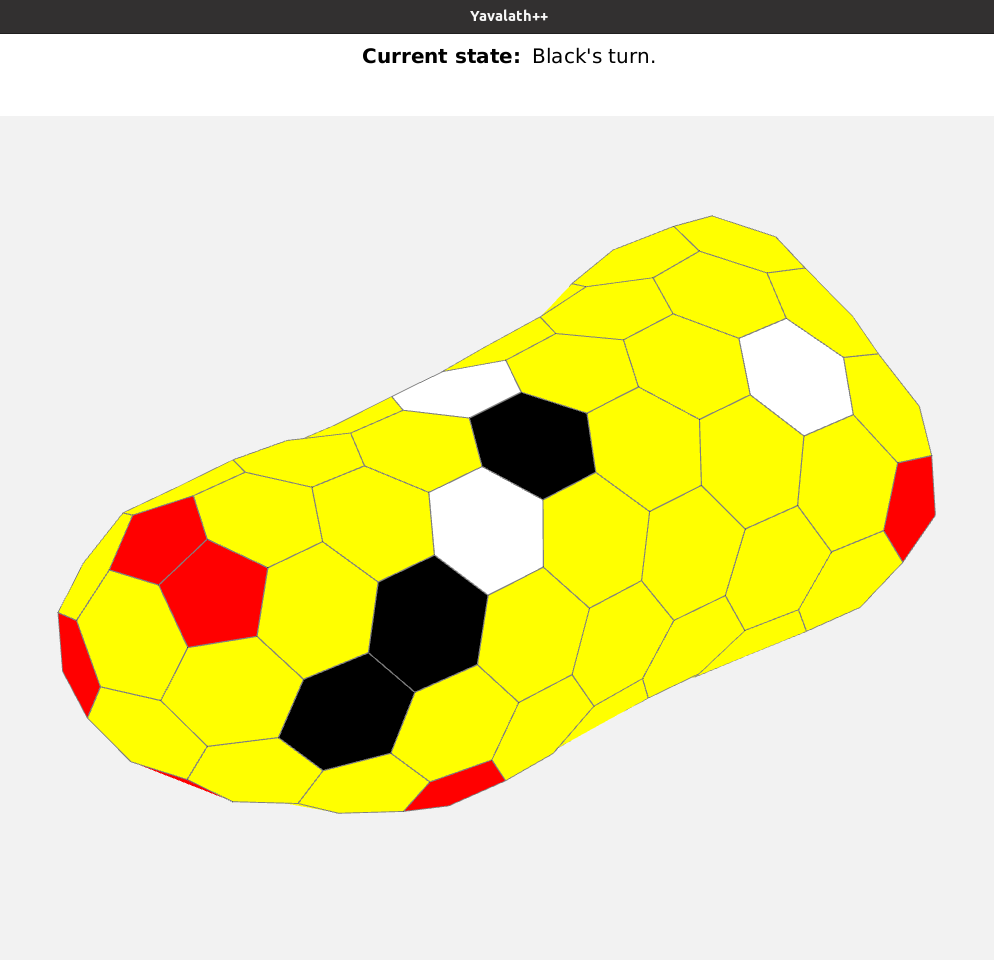

# Yavalath++
A board game AI written in Java for the course Algorithms and Datastructures. 

But there is a plot twist, instead of playing on a simple board, it was a 3D version of the yavalath board.

There are 2 versions of the AI. One that is very fast (uses heuristics) but doesn’t always play the most optimal move. And one that is slower but searches the entire game-tree to find the most optimal move. The latter uses the alpha-beta pruning algorithm that is based on the minimax algorithm).

