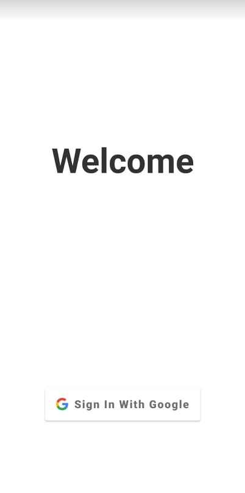

# RecipEase
The assignment of this project was "create an app". We were given (total) freedom, and had to invent and develop an app. 

This was done with a group of 4 people. We chose to create an app for people that live and eat together. 

You can create a group like your household or your dorm, and then you get a calendar for that group on which you can plan you meals. meals (dishes) are also a part of the app. You can search them online with an API and save them, or you can add your own meal-creations. 

Once all the planning is done you can generate a shopping list (and add products you also need but aren't in the dishes, like pudding or toiletpaper).

We really learned how to work with a bigger team of developpers than just 2 people. This teamwork was achieved by Github. We also had to learn the android framework and Kotlin programming language. 

